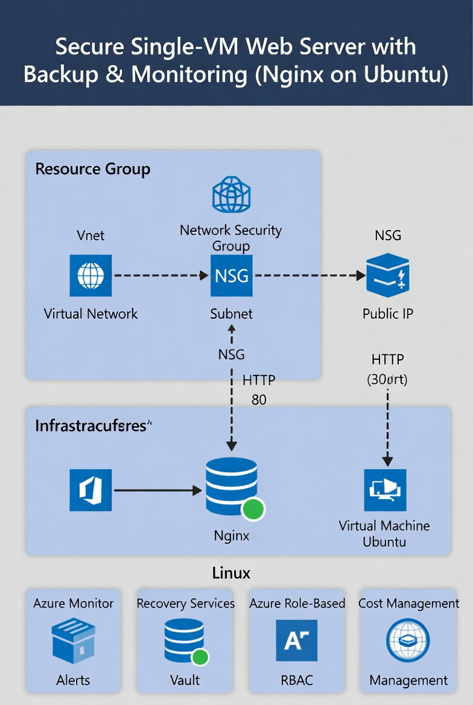
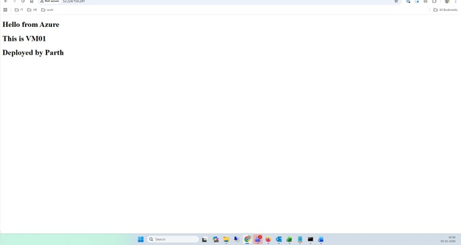
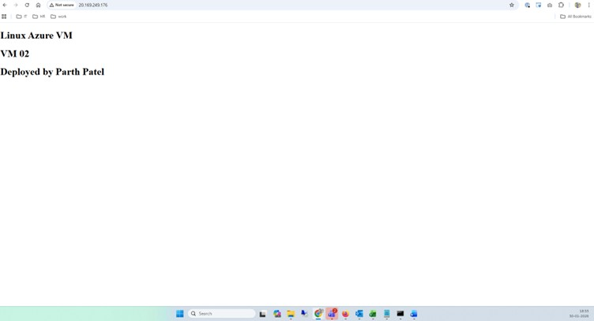

# ENTERPRISE AZ-104 ADMIN PROJECT

## Overview

This project demonstrates hands-on Azure Administrator (AZ-104) skills by designing, deploying, securing, monitoring, and cleaning up an enterprise-style Azure environment.

The focus of this project is on real-world Azure administration tasks such as networking, virtual machines, monitoring, backup, identity and access management (IAM), and cost control.

## Azure Services & Skills Covered

- Azure Resource Groups
- Virtual Networks (VNet) and Subnets
- Network Security Groups (NSG)
- Azure Virtual Machines (Linux)
- Public IP and Network Interfaces
- Azure Monitor and Alerts
- Recovery Services Vault (Backup)
- Azure Role-Based Access Control (RBAC)
- Cost Management

### Architecture Explanation

User requests are sent from a web browser over HTTP (port 80) to the public IP address assigned to the Azure virtual machine.  
Network Security Group (NSG) rules control and restrict inbound traffic.  
The traffic flows through the Virtual Network and subnet to a Linux virtual machine running Nginx, which serves the web content.

## Architecture Diagram
User (Browser)
     |
     | HTTP (Port 80)
     v
Public IP Address
     |
     v
Network Security Group (NSG)
     |
     v
Virtual Network (VNet)
     |
     v
Subnet
     |
     v
Linux Virtual Machine (Ubuntu)
     |
     v
Nginx Web Server

## Project Implementation Phases
### Phase 1: Resource Group & Networking
- Created a dedicated Resource Group to logically organize all project resources
- Designed a Virtual Network with a custom address space
- Created a subnet and associated Network Security Group (NSG)
- Configured inbound security rules to allow HTTP traffic securely

### Phase 2: Virtual Machine Deployment
- Deployed Linux Virtual Machines in East US region
- Selected cost-optimized VM sizes based on availability
- Configured public IP and network interfaces
- Ensured VMs were placed according to availability best practices

### Phase 3: Web Server Configuration
- Installed Nginx web server on Linux VM
- Verified web access using browser
- Confirmed HTTP traffic flow through NSG
### Phase 4: Monitoring & Alerts
- Enabled Azure Monitor for virtual machines
- Created CPU utilization alert to monitor VM performance
- Validated alert configuration and thresholds
### Phase 5: Backup & Recovery
- Created Recovery Services Vault
- Enabled backup for Azure virtual machines
- Verified successful backup status
### Phase 6: Identity & Access Management (IAM)
- Created a user with Reader role access
- Assigned RBAC permissions at Resource Group level
- Verified least-privilege access by blocking delete actions
### Phase 7: Validation
- Stopped one virtual machine to simulate failure
- Verified website availability using the running VM
- Confirmed alert existence and backup health
- Validated RBAC restrictions for Reader user
### Phase 8: Cleanup & Cost Control
- Disabled VM backups
- Deleted Recovery Services Vault
- Deleted virtual machines and associated resources
- Deleted resource group to ensure zero ongoing cost

## Screenshots

Screenshots are stored in the `screenshots` folder and provide evidence of:
- Web server access
- Monitoring alerts
  
## 

## 

## Key Learnings

- Designed secure Azure network architecture
- Implemented monitoring and alerting
- Configured backup and recovery
- Applied least privilege using RBAC
- Controlled cloud costs through proper cleanup

  ## Author

**Parth**  
AZ-104 Certified  
Azure Administrator

